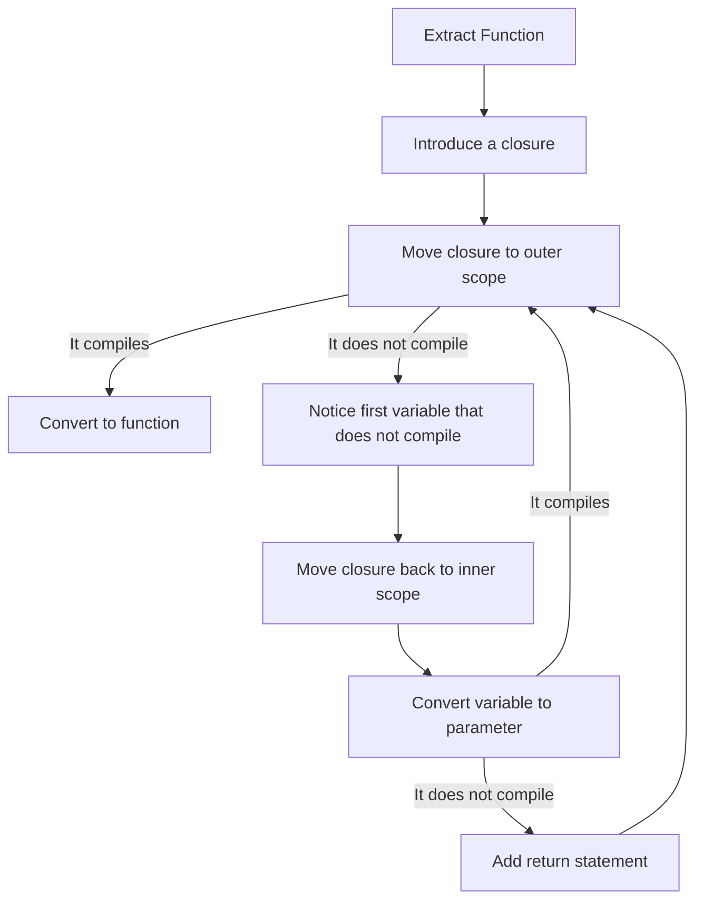



# Extract Function



# Recipe

## 1. Introduce a closure

Surround the code you want to extract with:

```swift
let closure: () -> Void = {
    // ...your code here
}
closure()
```

Compile. If you get an error, the closure contains an early return or the closure can't live at that location. Back up and extract something different.

## 2. Move closure to outer scope

Select the closure declaration, cut it, and paste it outside.

If it compiles, go to step ??? Convert to Function.

Otherwise, notice the first variable that doesn't compile and go to the next step.

## 3. Convert variable to parameter

Assume we have a variable `applesauce` that did not compile at outer scope.

Add a parameter to the closure signature and pass it in at the call site:

```swift
let closure: (_ applesauce: Type) -> Void = { applesauce in
    // ...your code here
}
closure(applesauce)
```

If this does not compile, go to step 4, Add return statement.

Otherwise, go to step 2, [Move closure to outer scope](#2-move-closure-to-outer-scope).

## 4.1 Add first return statement

In this situation, when we added the variable, the compiler complained that we were mutating it.
We are starting with:

```swift
let closure: (_ applesauce: Type) -> Void = { applesauce in
    // ...your code here
}
closure(applesauce)
```

### Step 1: Allow input to be mutated

Swift does not allow input parameters to be mutated.
Here, we are changing the parameter name and reassigning it to a `var` on the first line.

```swift
let closure: (_ applesauceIn: Type) -> Void = { applesauceIn in
    var applesauce = appleSauceIn
    // ...your code here
}
closure(applesauce)
```

### Step 2: Return and capture

We are going to:

1. Change the return type of the closure from `Void` to `Type`
1. Add a `return` statement at the end of the closure
1. Capture the returned value at the call site

```swift
let closure: (_ applesauceIn: Type) -> Type = { applesauceIn in
    var applesauce = appleSauceIn
    // ...your code here
    return applesauce
}
applesauce = closure(applesauce)
```

Now return step 2, [Move closure to outer scope](#2-move-closure-to-outer-scope).

## 4.2 Add second return statement

In this situation, when we added the variable, the compiler complained that we were mutating it.
We are starting with:

```swift
let closure: (_ applesauce1In: Type1, _ applesauce2In: Type2) -> Type1 = { applesauce1In, applesauce2 in
    var applesauce1 = appleSauce1In
    // ...your code here
    return applesauce1
}
applesauce1 = closure(applesauce1)
```

### Step 1: Allow input to be mutated

Swift does not allow input parameters to be mutated.
Here, we are changing the input name and reassigning it to a `var` on the second line.

```swift
let closure: (_ applesauce1In: Type1, _ applesauce2In: Type2) -> Type1 = { applesauce1In, applesauce2In in
    var applesauce1 = appleSauce1In
    var applesauce2 = appleSauce2In
    // ...your code here
    return applesauce1
}
applesauce1 = closure(applesauce1)
```

### Step 2: Return and capture

We are going to:

1. Change the return type of the closure from `Type1` to a tuple of `(Type1, Type2)`
1. Change the `return` to a tuple of both values
1. Capture and deconstruct the return values at the call site

```swift
let closure: (_ applesauce1In: Type1, _ applesauce2In: Type2) -> (Type1, Type2) = { applesauce1In, applesauce2In in
    var applesauce1 = appleSauce1In
    var applesauce2 = appleSauce2In
    // ...your code here
    return (applesauce1, applesauce2)
}
(applesauce1, applesauce2) = closure(applesauce1, applesauce2)
```

Now return step 2, [Move closure to outer scope](#2-move-closure-to-outer-scope).

