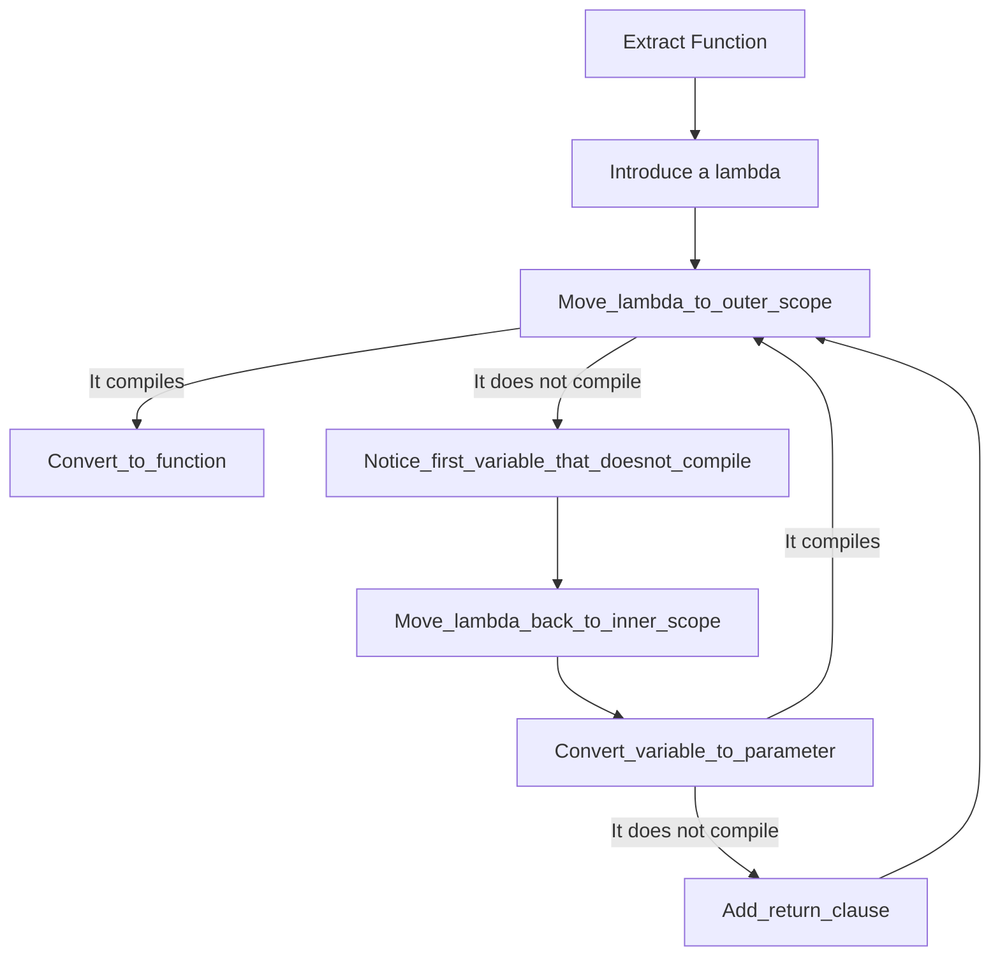



# Extract Function



# Recipe

## 1. Introduce a lambda

Surround the code you want to extract with:

```swift
let lambda: () -> Void = {
    ...your code here...
}
lambda()
```

Compile. Possible errors:

* `not all control paths return a value`. You have an early return. Back up and either [Eliminate Early Return/Continue/Break (fix link)](#) or extract something different.
* `a break/continue statement may only be used within ...`.  You have a break/continue. Back up and either [Eliminate Early Return/Continue/Break (fix link)](#) or extract something different. 

Search the new lambda for any return statements (using find). If there are any returns:

If it's obvious that all code paths return, then add a `return` before the lambda:

```cpp
return [&]() { 
    //...
}();
```

If it's not obvious that all code paths return, then back up and either [Eliminate Early Return/Continue/Break (fix link)](#) or try something different.

## 2. Move Lamda to Outer Scope

Select the lambda declaration, cut it, and paste it outside.

If it compiles, go to step ??? Convert to Function.

Otherwise, notice the first variable that doesn't compile and go to the next step.

## 3. Convert variable to parameter

Assume we have a variable applesauce that did not compile at outer scope.

Add variable to method signature and call it:

```swift
let lambda: (_ applesauce: Type) -> Void = { applesauce in
    ...your code here...
}
lambda(applesauce)
```

If this does not compile, go to step 4, Add return clause.

Otherwise, go to step 2, Move Lamda to Outer Scope.

## 4.1 Add first return clause

In this situation, when we added the variable, the compiler complained that we were mutating it.
We are starting with:

```swift
let lambda: (_ applesauce: Type) -> Void = { applesauce in
    ...your code here...
}
lambda(applesauce)
```

Step 1: Allow input to be mutated

Swift does not allow input parameters to be mutated.
Here, we are changing the input name and reassigning it to a `var` on the first line.

```swift
let lambda: (_ applesauce: Type) -> Void = { applesauceIn in
    var applesauce = appleSauceIn
    ...your code here...
}
lambda(applesauce)
```

Step 2: Return and capture

We are going to:

1. Change the return type of the lambda from Void to Type
1. Add a return statement at the end of the lambda
1. Capture the return at the call site

```swift
let lambda: (_ applesauce: Type) -> Type = { applesauceIn in
    var applesauce = appleSauceIn
    ...your code here...
    return applesauce
}
applesauce = lambda(applesauce)
```

## 4.2 Add second return clause

In this situation, when we added the variable, the compiler complained that we were mutating it.
We are starting with:

```swift
let lambda: (_ applesauce1In: Type1, _ applesauce2: Type2) -> Type1 = { applesauce1In, applesauce2 in
    var applesauce1 = appleSauce1In
    ...your code here...
    return applesauce1
}
applesauce1 = lambda(applesauce1, applesauce2)
```

Step 1: Allow input to be mutated

Swift does not allow input parameters to be mutated.
Here, we are changing the input name and reassigning it to a `var` on the first line.

```swift
let lambda: (_ applesauce1In: Type1, _ applesauce2In: Type2) -> Type1 = { applesauce1In, applesauce2In in
    var applesauce1 = appleSauce1In
    var applesauce2 = appleSauce2In
    ...your code here...
    return applesauce1
}
applesauce1 = lambda(applesauce1, applesauce2)
```

Step 2: Return and capture

We are going to:

1. Change the return type of the lambda from Type1 to a tuple of (Type1, Type2)
1. Change the return to a tuple of both
1. Capture and deconstruct return at the call site

```swift
let lambda: (_ applesauce1In: Type1, _ applesauce2In: Type2) -> (Type1, Type2) = { applesauce1In, applesauce2In in
    var applesauce1 = appleSauce1In
    var applesauce2 = appleSauce2In
    ...your code here...
    return (applesauce1, applesauce2)
}
(applesauce1, applesauce2) = lambda(applesauce1, applesauce2)
```


## 4. Capture explicitly

Replace `[&]` with `[this]` (or `[]` in a free function) and compile.

For each error about a variable that must be captured:
1. Copy the variable name
2. Paste it in to the capture list, prefixed with `&`. 
3. Repeat until green.

For example,

```cpp
auto Applesauce = [this, &foo]() -> bool {
    cout << foo;
};
```

The order of the capture list will influence the order of the parameters of the final function. If you want the parameters in a particular order, now is a good time to reorder the capture list.

## 5. Convert captures to parameters

1. Select the capture list (but not 'this') and Cut
2. Paste into the argument list, removing `&`s.
3. Paste into the parameter list and inject `const auto` in front of each parameter
4. Compile. 
5. If you get an error because the variable is modified, make it non-const

For example,

```cpp
auto Applesauce = [this, &i, &s]() -> void
{
	cout << ++i << s;
};
Applesauce();
```

becomes:

```cpp
auto Applesauce = [this](auto &i, const auto &s) -> void
{
	cout << ++i << s;
};
Applesauce(i, s);
```

## 6. Explicitly specify parameter types 

For each argument:

1. Go-to-definiton on the argument
2. Copy the variable type
3. Paste into the lambda parameter list
4. Compile

For example,

```cpp
int i = ...
std::string s = ...

auto Applesauce = [this](auto &i, const auto &s) -> void
{
    std::cout << ++i << s;
};
Applesauce(i, s);
```

becomes:

```cpp
int i = ...
std::string s = ...

auto Applesauce = [this](int &i, const std::string &s) -> void
{
    std::cout << ++i << s;
};
Applesauce(i, s);
```

### About pointer parameters and the `const` keyword

When the parameter is a pointer type, it's important to understand how the placement of the const keyword affects the parameter
type. 

For example, given a local variable in `Column* pCol = ...`, the original type is "Pointer to `Column`", so the pointer is what
must be const (so we know it's not reseated to point to another object). It's also important to specify that the `Column` itself is 
const to avoid losing the implicit constness in the original code as we make the data flow explicit.

```cpp
const Column* // WRONG - this is a non-const pointer to const column
Column const* // WRONG - same as above
Column* const // BETTER - this is a const pointer to non-const column
Column const * const // BEST - this is a const pointer to const column
```

To avoid ambiguity, always place the const keyword to the right of what you want to make const.

## 7. Try to eliminate `this` capture

1. Remove `this` from the capture list
2. Compile
3. If the compile fails, undo

For example,

```cpp
auto Applesauce = [this]() -> void {
    // ...
};
```

becomes:

```cpp
auto Applesauce = []() -> void {
    // ...
};
```

## 8. Convert lambda to function

* If `this` is captured, use 8A.
* If `this` is not captured, use 8B.

### 8A. Convert `this`-bound lambda to member function

1. Cut the lambda statement and paste it outside the current function.
2. Remove `= [this]`.
3. Mark the new method as `const`.
4. Copy the signature line.
5. Add `SomeClass::`
6. Paste the signature in to the class declaration in a private section.
7. Compile and remove `const` if necessary.

For example,

```cpp
class SomeClass
{
private:
    auto Applesauce () const -> void;
}

auto SomeClass::Applesauce () const -> void {
    // ...
};
```

### 8B. Convert non-`this` Lambda to free function

1. Cut the lambda statement and paste it above the current function.
2. Remove `= []`
3. Wrap it in an anonymous namespace
4. Compile and resolve any errors:
5. If the free function uses typedefs/aliases or classes nested in the original class, convert the free function to a private static function of the original class.

For example,

```cpp
namespace {
auto Applesauce () -> void {
    ...
};
}
```

### 9. Convert return value from lambda-like syntax to traditional syntax
 1. Select the return value (after the `->`) and cut it.
2. Delete the `->`
3. Select the word `auto` and paste the return value over it.
4. Remove the trailing semicolon.

 For example,
 ```cpp
namespace {
auto Applesauce () -> void {
    ...
};
}
```
 becomes:
 ```cpp
namespace {
void Applesauce () {
    ...
}
}
```
